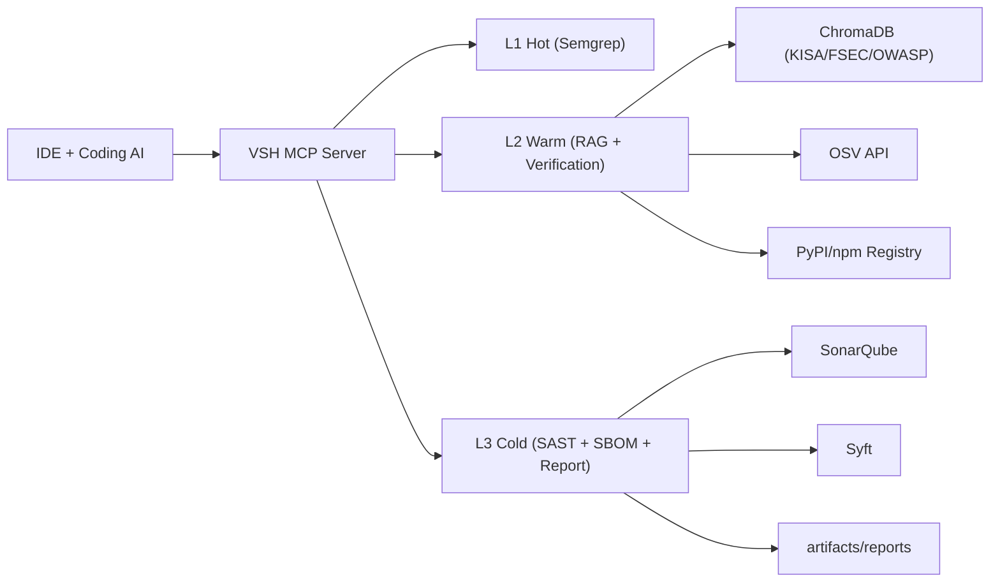

# VSH Architecture (Design v0)

## 1. Scope

VSH는 AI 코딩 워크플로에서 보안 검증을 수행하는 FastMCP 서버다.
이 문서는 구현 전 고정해야 하는 컴포넌트 경계, 데이터 흐름, 실패 정책을 정의한다.

## 2. System Context

## 3. Runtime Components

- MCP Adapter (`src/vsh/mcp_server.py`)
  - MCP tool 입력 검증
  - L1/L2/L3 서비스 라우팅
  - 공통 에러 포맷 반환
- L1 Service (`src/vsh/l1_hot/service.py`)
  - 빠른 패턴 탐지 및 finding 정규화
  - 코드 의미 변경 없는 annotation patch 생성
- L2 Service (`src/vsh/l2_warm/service.py`)
  - 근거 문서 매핑(RAG)
  - 공급망 검증(Registry/OSV)
  - 최소 수정 fix patch 생성
- L3 Service (`src/vsh/l3_cold/service.py`)
  - 저장소 단위 심층 분석
  - SBOM/취약점/컴플라이언스 기반 보고서 생성

## 4. Tool Sequence

### 4.1 `vsh.l1.scan_annotate`

1. 입력 스키마 검증
2. Semgrep 실행 (네트워크 없음)
3. Finding 정규화
4. Annotation patch 생성
5. timing/error 포함 응답

Target SLA: p95 < 1s

### 4.2 `vsh.l2.enrich_fix`

1. L1 findings 입력 수신
2. KISA/FSEC 근거 검색
3. Registry/OSV 검증
4. 오탐 조정 + fix patch 생성
5. evidence/verification 포함 응답

Target SLA: p95 1~3s

### 4.3 `vsh.l3.full_report`

1. repo_path 스캔 준비
2. Sonar/SBOM/OSV 결과 수집
3. baseline_findings + actions_log 병합
4. Markdown/JSON 리포트 생성

Target SLA: batch/background

## 5. Cross-cutting Design Decisions

- Human-in-the-Loop
  - patch 적용은 사용자 승인 후에만 허용
- Deterministic Output
  - Finding ID는 재현 가능한 규칙 기반 생성 권장
- Explainability
  - 모든 finding은 근거 키(`kisa_key`, `fsec_key`) 우선 제공
- Failure Tolerance
  - L2/L3 외부 연동 실패 시 해당 항목만 `UNKNOWN` 처리
  - 가능한 산출물은 계속 반환
- Security
  - 비밀정보 하드코딩 금지
  - 보고서/아티팩트 기본 경로는 `artifacts/`

## 6. Package Boundaries

- `src/vsh/common/`
  - Pydantic 모델, enum, 공통 타입
- `src/vsh/l1_hot/`
  - semgrep runner, normalize, annotate, orchestrator
- `src/vsh/l2_warm/`
  - orchestrator, rag retriever, verification adapters
- `src/vsh/l3_cold/`
  - orchestrator, sonar/sbom runner, report renderer

## 7. Immediate Implementation Gate

L1 MVP 완료 기준:

- 취약 샘플에서 finding 1개 이상
- 안전 샘플에서 오탐 최소화
- unified diff patch 문자열 유효성 확보
